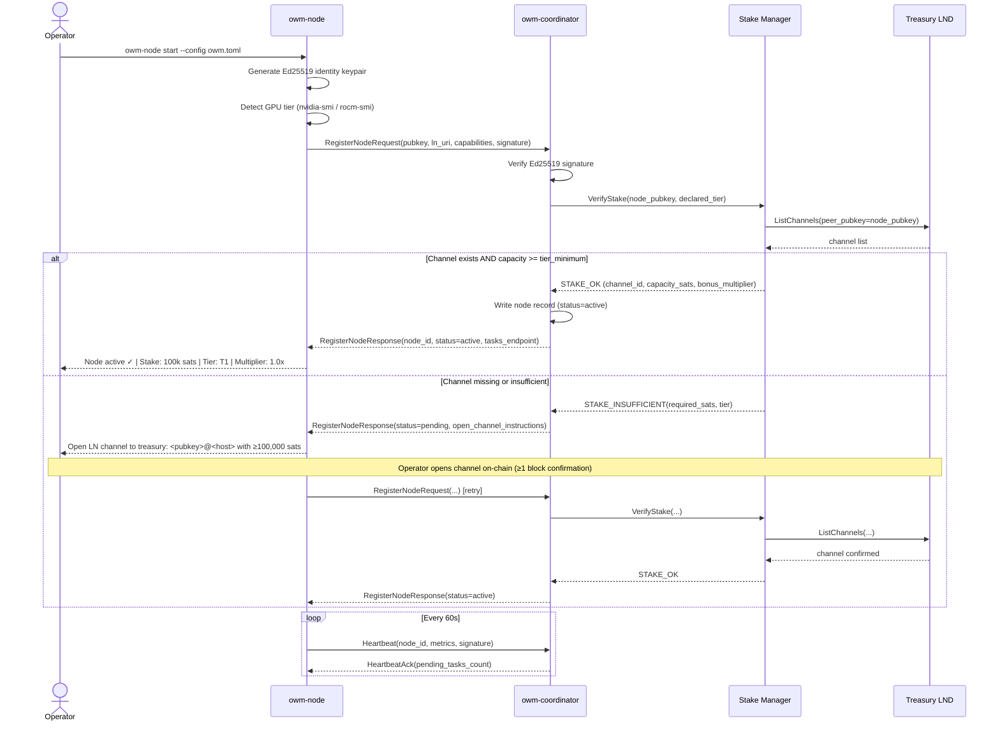
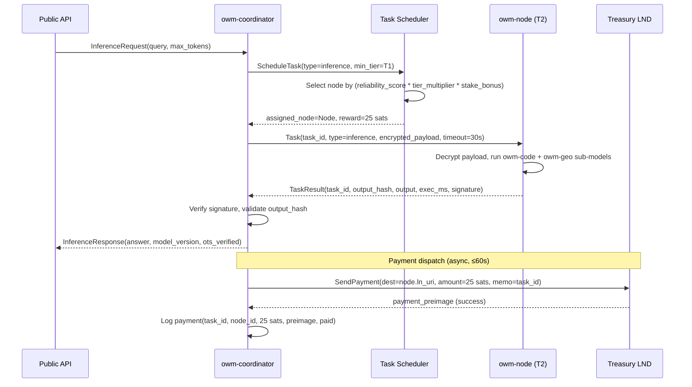
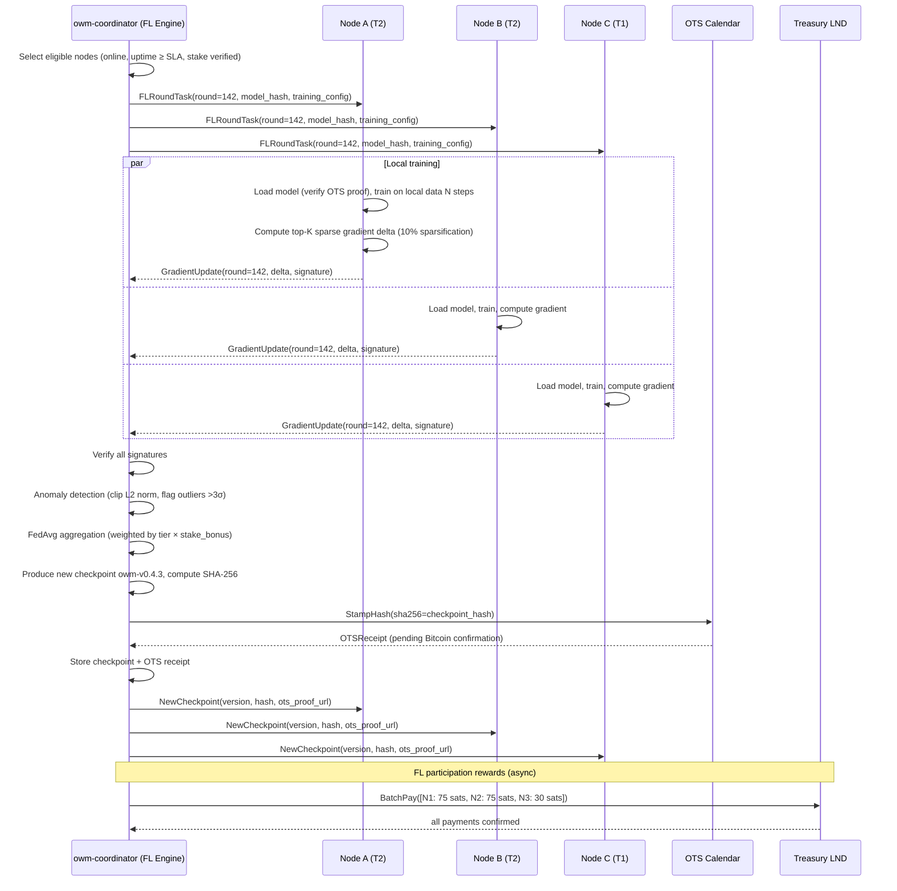
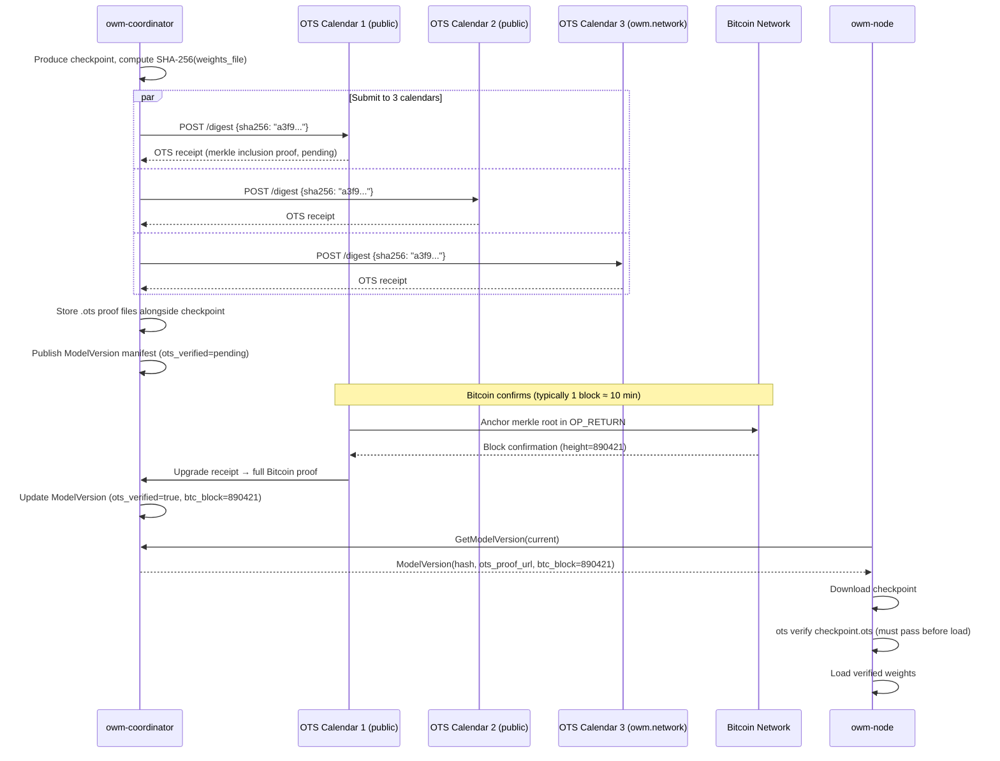
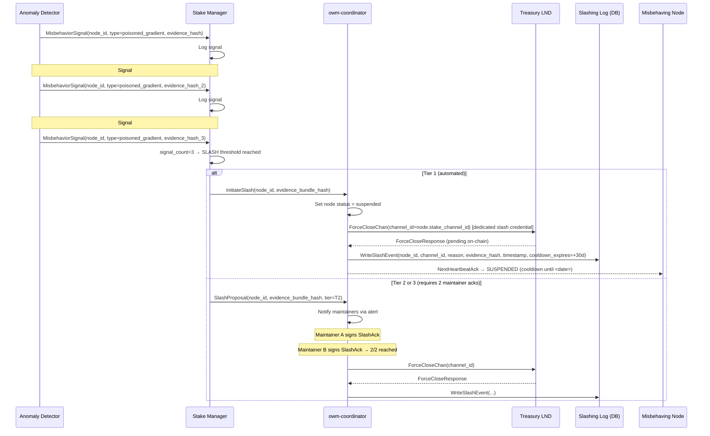
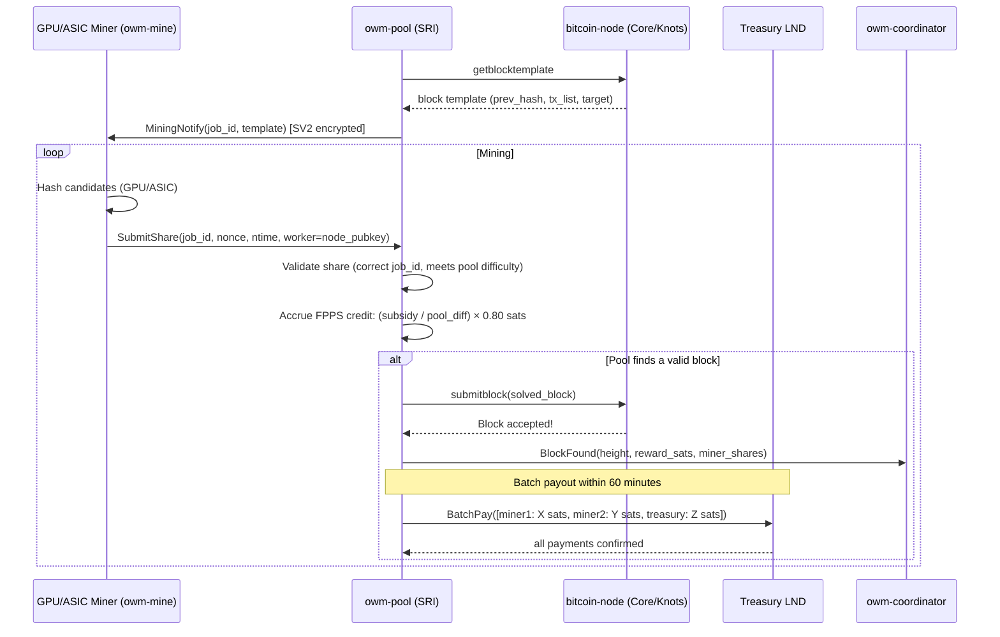
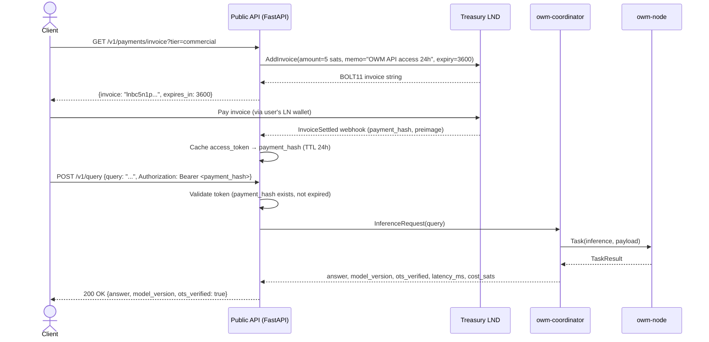
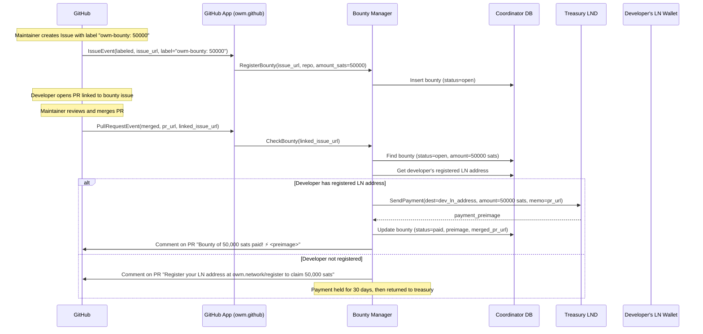

# OWM System Architecture

**Version:** 1.0.0
**Date:** 2026-03-05
**Status:** Approved

---

## Table of Contents

1. [Overview](#1-overview)
2. [Component Topology](#2-component-topology)
3. [Sequence Diagrams](#3-sequence-diagrams)
   - 3.1 [Node Registration & Stake Verification](#31-node-registration--stake-verification)
   - 3.2 [Task Dispatch & Compute Reward](#32-task-dispatch--compute-reward)
   - 3.3 [Federated Learning Round](#33-federated-learning-round)
   - 3.4 [Model Version Anchoring (OpenTimestamps)](#34-model-version-anchoring-opentimestamps)
   - 3.5 [Slashing Flow](#35-slashing-flow)
   - 3.6 [Mining Pool Share & Payout](#36-mining-pool-share--payout)
   - 3.7 [Commercial API Request (Lightning Gated)](#37-commercial-api-request-lightning-gated)
   - 3.8 [GitHub Bounty Payment](#38-github-bounty-payment)
4. [Database Schema (Coordinator)](#4-database-schema-coordinator)
5. [Network Communication Matrix](#5-network-communication-matrix)
6. [Deployment Topology](#6-deployment-topology)

---

## 1. Overview

The OWM system is composed of five independently deployable services that communicate over encrypted channels:

| Service | Language | Role |
|---|---|---|
| `owm-coordinator` | Go 1.22 | Central registry, task scheduler, FL orchestrator, PoS enforcer |
| `owm-node` | Python 3.11 + Rust | Contributor node daemon — inference, training, mining |
| `owm-pool` | Rust (SRI) | Stratum v2 Bitcoin mining pool |
| `owm-governance` | Python / HTMX | Rough-consensus governance portal |
| `bitcoin-node` | Bitcoin Core / Knots | Full node for pool `getblocktemplate` |

All inter-service communication between the coordinator and nodes uses **mTLS + gRPC**. The Lightning Network provides the payment rail. The Bitcoin blockchain (via OpenTimestamps) provides model provenance.

---

## 2. Component Topology

```
┌─────────────────────────────────────────────────────────────────────────────┐
│                            Internet / P2P                                   │
│                                                                             │
│   Node Operators                          Miners / ASIC Operators           │
│   ┌──────────┐  ┌──────────┐             ┌──────────┐  ┌──────────┐        │
│   │ owm-node │  │ owm-node │             │ GPU Miner│  │   ASIC   │        │
│   │  (T1/T2) │  │  (T3)   │             │ (owm-mine│  │  Farmer  │        │
│   └────┬─────┘  └────┬─────┘             └────┬─────┘  └────┬─────┘        │
│        │ mTLS/gRPC   │ mTLS/gRPC              │ SV2         │ SV2          │
│        │             │                         │             │              │
│        └──────┬──────┘              ┌──────────┘             │              │
│               │                    ▼                         │              │
│               ▼           ┌─────────────────┐               │              │
│   ┌───────────────────┐   │   owm-pool      │◄──────────────┘              │
│   │  owm-coordinator  │   │ (Stratum v2)    │                              │
│   │                   │   │                 │                              │
│   │  ┌─────────────┐  │   │ ┌─────────────┐│                              │
│   │  │  Registry   │  │   │ │FPPS Engine  ││                              │
│   │  │  Scheduler  │  │   │ └──────┬──────┘│                              │
│   │  │  FL Engine  │  │   └────────┼────────┘                             │
│   │  │  Stake Mgr  │  │            │ 20% block reward (LN)                │
│   │  └──────┬──────┘  │            ▼                                      │
│   │         │         │   ┌─────────────────┐       ┌──────────────────┐  │
│   │  ┌──────▼──────┐  │   │  LND Treasury   │◄──────│  bitcoin-node    │  │
│   │  │  PostgreSQL │  │   │  (multisig)     │       │ (Core / Knots)   │  │
│   │  └─────────────┘  │   └────────┬────────┘       └──────────────────┘  │
│   └───────────────────┘            │ 80% rewards + compute pay (LN)       │
│                                    ▼                                       │
│                          ┌──────────────────┐                              │
│                          │   Public API      │  ┌────────────────────────┐ │
│                          │   (FastAPI)       │  │  owm-governance        │ │
│                          └──────────────────┘  │  (HTMX portal)         │ │
│                                                └────────────────────────┘ │
└─────────────────────────────────────────────────────────────────────────────┘
```

---

## 3. Sequence Diagrams

### 3.1 Node Registration & Stake Verification



---

### 3.2 Task Dispatch & Compute Reward



---

### 3.3 Federated Learning Round



---

### 3.4 Model Version Anchoring (OpenTimestamps)



---

### 3.5 Slashing Flow



---

### 3.6 Mining Pool Share & Payout



---

### 3.7 Commercial API Request (Lightning Gated)



---

### 3.8 GitHub Bounty Payment



---

## 4. Database Schema (Coordinator)

All coordinator state lives in PostgreSQL. The schema is versioned with migrations.

```sql
-- nodes
CREATE TABLE nodes (
    node_id         UUID PRIMARY KEY DEFAULT gen_random_uuid(),
    public_key      TEXT NOT NULL UNIQUE,         -- Ed25519 hex
    ln_node_uri     TEXT NOT NULL,                -- pubkey@host:port
    tier            TEXT NOT NULL CHECK (tier IN ('t1','t2','t3')),
    vram_gb         NUMERIC(6,2),
    ram_gb          NUMERIC(6,2),
    bandwidth_mbps  NUMERIC(8,2),
    reliability     NUMERIC(5,4) DEFAULT 1.0,     -- 0.0–1.0 rolling 7d
    total_tasks     INTEGER DEFAULT 0,
    total_sats      BIGINT DEFAULT 0,
    status          TEXT NOT NULL DEFAULT 'pending'
                    CHECK (status IN ('pending','active','degraded','suspended')),
    registered_at   TIMESTAMPTZ DEFAULT now(),
    last_heartbeat  TIMESTAMPTZ
);

-- node_stakes
CREATE TABLE node_stakes (
    node_id             UUID PRIMARY KEY REFERENCES nodes(node_id),
    channel_id          TEXT NOT NULL UNIQUE,     -- LN channel ID hex
    channel_capacity    BIGINT NOT NULL,           -- total sats
    local_balance       BIGINT NOT NULL,           -- node's locked sats
    tier_minimum        BIGINT NOT NULL,           -- required for tier
    bonus_multiplier    NUMERIC(4,3) DEFAULT 1.0, -- 1.000–2.000
    stake_status        TEXT NOT NULL DEFAULT 'active'
                        CHECK (stake_status IN ('active','degraded','force_closed')),
    opened_at           TIMESTAMPTZ DEFAULT now(),
    last_verified_at    TIMESTAMPTZ DEFAULT now(),
    degraded_since      TIMESTAMPTZ
);

-- tasks
CREATE TABLE tasks (
    task_id         UUID PRIMARY KEY DEFAULT gen_random_uuid(),
    task_type       TEXT NOT NULL,
    assigned_node   UUID REFERENCES nodes(node_id),
    status          TEXT NOT NULL DEFAULT 'pending'
                    CHECK (status IN ('pending','running','completed','failed','timeout')),
    input_hash      TEXT,
    output_hash     TEXT,
    reward_sats     INTEGER,
    payment_status  TEXT DEFAULT 'pending'
                    CHECK (payment_status IN ('pending','paid','failed')),
    payment_preimage TEXT,
    submitted_at    TIMESTAMPTZ DEFAULT now(),
    started_at      TIMESTAMPTZ,
    completed_at    TIMESTAMPTZ,
    timeout_seconds INTEGER DEFAULT 30
);

-- fl_rounds
CREATE TABLE fl_rounds (
    round_id        SERIAL PRIMARY KEY,
    round_number    INTEGER NOT NULL UNIQUE,
    status          TEXT NOT NULL DEFAULT 'open'
                    CHECK (status IN ('open','aggregating','complete','failed')),
    model_version   TEXT,                          -- output version
    checkpoint_hash TEXT,
    ots_proof_path  TEXT,
    btc_block       INTEGER,
    started_at      TIMESTAMPTZ DEFAULT now(),
    completed_at    TIMESTAMPTZ,
    participant_count INTEGER
);

-- fl_participants
CREATE TABLE fl_participants (
    round_id        INTEGER REFERENCES fl_rounds(round_id),
    node_id         UUID REFERENCES nodes(node_id),
    gradient_hash   TEXT,
    anomaly_flagged BOOLEAN DEFAULT FALSE,
    reward_sats     INTEGER,
    PRIMARY KEY (round_id, node_id)
);

-- model_versions
CREATE TABLE model_versions (
    version_id          TEXT PRIMARY KEY,          -- e.g. "owm-v0.4.2"
    round_number        INTEGER REFERENCES fl_rounds(round_number),
    created_at          TIMESTAMPTZ DEFAULT now(),
    sub_model_hashes    JSONB,                     -- {sub_model_id: sha256}
    ots_proof_paths     JSONB,                     -- {sub_model_id: path}
    btc_block           INTEGER,
    coordinator_sig     TEXT,
    is_current          BOOLEAN DEFAULT FALSE
);

-- slashing_events
CREATE TABLE slashing_events (
    event_id            UUID PRIMARY KEY DEFAULT gen_random_uuid(),
    node_id             UUID REFERENCES nodes(node_id),
    channel_id          TEXT NOT NULL,
    tier                TEXT NOT NULL,
    reason              TEXT NOT NULL,
    evidence_hash       TEXT NOT NULL,
    signal_count        INTEGER NOT NULL,
    executed_at         TIMESTAMPTZ DEFAULT now(),
    cooldown_expires_at TIMESTAMPTZ NOT NULL,
    coordinator_sig     TEXT NOT NULL
);

-- misbehavior_signals
CREATE TABLE misbehavior_signals (
    signal_id       UUID PRIMARY KEY DEFAULT gen_random_uuid(),
    node_id         UUID REFERENCES nodes(node_id),
    signal_type     TEXT NOT NULL,
    evidence_hash   TEXT NOT NULL,
    detected_at     TIMESTAMPTZ DEFAULT now(),
    slashing_event  UUID REFERENCES slashing_events(event_id)
);

-- bounties
CREATE TABLE bounties (
    bounty_id       UUID PRIMARY KEY DEFAULT gen_random_uuid(),
    github_issue    TEXT NOT NULL UNIQUE,
    github_repo     TEXT NOT NULL,
    amount_sats     BIGINT NOT NULL,
    status          TEXT NOT NULL DEFAULT 'open'
                    CHECK (status IN ('open','claimed','paid','expired')),
    claimed_by      TEXT,                          -- GitHub login
    merged_pr_url   TEXT,
    created_at      TIMESTAMPTZ DEFAULT now(),
    paid_at         TIMESTAMPTZ,
    payment_preimage TEXT
);

-- Indexes
CREATE INDEX idx_nodes_status         ON nodes(status);
CREATE INDEX idx_nodes_pubkey         ON nodes(public_key);
CREATE INDEX idx_tasks_assigned_node  ON tasks(assigned_node, status);
CREATE INDEX idx_tasks_submitted      ON tasks(submitted_at DESC);
CREATE INDEX idx_slashing_node        ON slashing_events(node_id);
CREATE INDEX idx_signals_node         ON misbehavior_signals(node_id, detected_at DESC);
```

---

## 5. Network Communication Matrix

| From | To | Protocol | Auth | Port |
|---|---|---|---|---|
| `owm-node` | `owm-coordinator` | gRPC + mTLS | Ed25519 node identity cert | 9000 |
| `owm-node` | `owm-pool` | Stratum v2 (Noise) | OWM Ed25519 identity key | 3333 |
| `owm-coordinator` | `Treasury LND` | gRPC | Macaroon (admin) | 10009 |
| `owm-coordinator` | `Treasury LND` (slash) | gRPC | Macaroon (restricted: ForceCloseChan only) | 10009 |
| `owm-pool` | `bitcoin-node` | JSON-RPC over HTTP | RPC username/password | 8332 |
| `owm-pool` | `Treasury LND` | gRPC | Macaroon (invoice + pay) | 10009 |
| `Public API` | `owm-coordinator` | gRPC (internal) | Service mesh mTLS | 9001 |
| `GitHub App` | `owm-coordinator` | HTTP (internal) | Service token | 9002 |
| Operators | `Public API` | HTTPS | API key / LN invoice | 443 |
| Operators | `owm-governance` | HTTPS | Node identity signature | 443 |
| `OTS Calendars` | External | HTTPS | None (public) | 443 |

---

## 6. Deployment Topology

```
                        ┌──────────────────────────────┐
                        │   Coordinator Cluster (k8s)  │
                        │                              │
                        │  ┌──────────┐ ┌──────────┐  │
                        │  │coord-api │ │coord-api │  │    ← 2 replicas
                        │  │replica-1 │ │replica-2 │  │
                        │  └────┬─────┘ └────┬─────┘  │
                        │       └──────┬──────┘        │
                        │         ┌────▼────┐          │
                        │         │postgres │          │    ← primary + 1 read replica
                        │         │ (WAL)   │          │
                        │         └─────────┘          │
                        │  ┌───────┐  ┌────────────┐   │
                        │  │ redis │  │ minio/S3   │   │    ← cache + model storage
                        │  └───────┘  └────────────┘   │
                        │  ┌──────────────────────┐    │
                        │  │  owm-pool  (Rust)    │    │    ← mining pool
                        │  └──────────────────────┘    │
                        │  ┌──────────────────────┐    │
                        │  │  bitcoin-node         │   │    ← Core or Knots
                        │  └──────────────────────┘    │
                        │  ┌──────────────────────┐    │
                        │  │  LND (treasury)      │    │    ← Lightning node
                        │  └──────────────────────┘    │
                        │  ┌──────────────────────┐    │
                        │  │  OTS calendar        │    │    ← self-hosted OTS
                        │  └──────────────────────┘    │
                        │  ┌──────────────────────┐    │
                        │  │  Public API (FastAPI) │   │    ← 2 replicas
                        │  └──────────────────────┘    │
                        │  ┌──────────────────────┐    │
                        │  │  Governance Portal   │    │
                        │  └──────────────────────┘    │
                        │  ┌──────────────────────┐    │
                        │  │  nginx (TLS, gateway) │   │
                        │  └──────────────────────┘    │
                        └──────────────────────────────┘
                                     ↕ P2P gRPC/mTLS
                ┌────────────────────────────────────────────┐
                │              Node Operators (self-hosted)  │
                │  ┌──────────┐  ┌──────────┐  ┌──────────┐ │
                │  │owm-node  │  │owm-node  │  │owm-node  │ │
                │  │T1 + mine │  │T2 + mine │  │T3        │ │
                │  └──────────┘  └──────────┘  └──────────┘ │
                └────────────────────────────────────────────┘
```

---

*End of Architecture Document v1.0.0*
